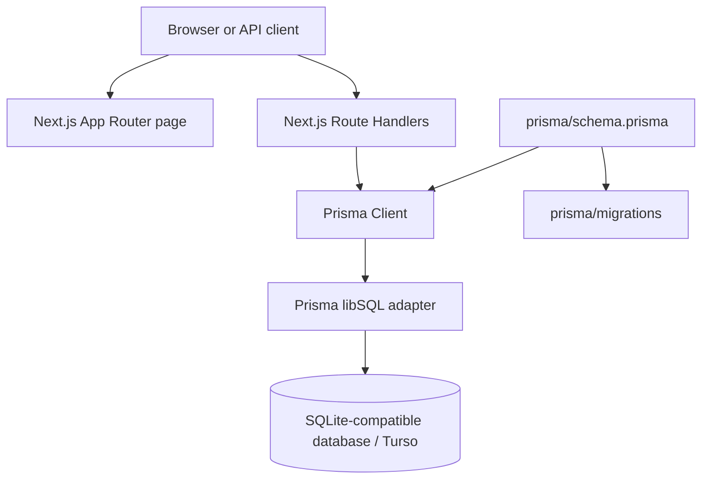

# Todo Application

An API-first todo application built with Next.js, TypeScript, Prisma 7, and a SQLite-compatible database. The project currently provides the todo data model and CRUD API; the browser homepage is still a minimal placeholder that displays the application title.

## What the project does

The application is designed to support users who own todo items. A todo can have a title, optional description, completion status, creation time, update time, and an owning user.

Current capabilities:

- Read all todos, newest first.
- Create a todo with a title, description, and user ID.
- Read one todo by ID.
- Update a todo with `PATCH`.
- Delete a todo.
- Store users and todos with a one-to-many relationship.
- Cascade-delete a user's todos when that user is deleted at the database level.
- Return JSON responses with success flags, messages, data, and HTTP status codes.

The following features are represented in the database schema but are not implemented in the UI or API yet:

- User registration and login.
- Password hashing and authentication.
- Role-based access control for `USER` and `ADMIN`.
- Filtering todos by the authenticated user.
- A complete todo management interface.

## Technology stack

- **Next.js 16** with the App Router and Route Handlers.
- **React 19** and TypeScript.
- **Prisma 7** for schema management and database access.
- **SQLite-compatible storage**, accessed at runtime through `@prisma/adapter-libsql`.
- **Turso/libSQL support** through `DATABASE_URL` and `TURSO_AUTH_TOKEN`.
- **Tailwind CSS 4** and `tw-animate-css` for styling.
- **Base UI** and a generated button component for reusable UI primitives.
- **Zod** and React Hook Form are installed for future validation/forms, but are not currently used by the implemented pages.

## Architecture

The project follows a small full-stack Next.js architecture:



### Presentation layer

- `app/page.tsx` is the root homepage. It currently renders only a centered `Todo Application` heading.
- `app/layout.tsx` is the root layout. It loads the Geist fonts, global CSS, HTML language metadata, and the common page body structure.
- `app/globals.css` imports Tailwind and shadcn styling, defines theme variables, and provides light/dark color tokens.
- `components/ui/button.tsx` contains a reusable button built on Base UI with class-variance-authority variants.

### API layer

Next.js Route Handlers expose HTTP endpoints directly from the `app/api` directory. Each handler reads the request, calls Prisma, and returns a `NextResponse.json` response.

- `app/api/todos/route.ts` contains collection operations: `GET` and `POST`.
- `app/api/[id]/route.ts` contains single-record operations: `GET`, `PATCH`, and `DELETE`.

There is no separate controller, service, or repository layer yet. Route Handlers currently perform request handling and database calls together.

### Data layer

- `lib/prisma.ts` creates the Prisma Client using `PrismaLibSql`.
- `prisma/schema.prisma` defines the `User` and `Todo` models and their relationship.
- `prisma/migrations` stores the database migration history.
- `prisma.config.ts` tells Prisma where the schema and migrations are located and loads `DATABASE_URL` for Prisma CLI operations.

### Shared utilities and configuration

- `lib/utils.ts` exports `cn`, a helper that combines conditional class names and merges Tailwind classes.
- `middleware.ts` currently passes every request through unchanged. It is a placeholder for future authentication or request protection.
- `tsconfig.json` enables strict TypeScript and the `@/*` import alias, so `@/lib/prisma` maps to `lib/prisma.ts`.

## Database model

### User

| Field | Type | Description |
|---|---|---|
| `id` | `String` | CUID primary key |
| `name` | `String` | User name |
| `email` | `String` | Required and unique |
| `password` | `String` | Stored password field; authentication is not implemented |
| `role` | `Role` | `USER` by default, or `ADMIN` |
| `createdAt` | `DateTime` | Creation timestamp |

### Todo

| Field | Type | Description |
|---|---|---|
| `id` | `String` | CUID primary key |
| `title` | `String` | Required todo title |
| `description` | `String?` | Optional description |
| `completed` | `Boolean` | Defaults to `false` |
| `createdAt` | `DateTime` | Creation timestamp |
| `updatedAt` | `DateTime` | Automatically updated by Prisma |
| `userId` | `String` | Required foreign key to `User` |

Relationship: one `User` can have many `Todo` records. A todo must belong to an existing user, and deleting a user cascades to that user's todos.

## API reference

### `GET /api/todos`

Returns all todos ordered by `createdAt` descending.

Example response:

```json
{
  "success": true,
  "data": []
}
```

### `POST /api/todos`

Creates a todo. The request body must include `title` and `userId`.

```json
{
  "title": "Learn Prisma",
  "description": "Review the data access layer",
  "userId": "user_cuid"
}
```

Returns `201 Created` on success and `400 Bad Request` when `title` or `userId` is missing.

### `GET /api/:id`

Returns one todo by ID. The route file is `app/api/[id]/route.ts`, so the implemented URL is `/api/:id`.

> The comments inside the route currently say `/api/todos/:id`, but the directory structure does not create that URL. If the intended URL is `/api/todos/:id`, move the route to `app/api/todos/[id]/route.ts`.

### `PATCH /api/:id`

Updates a todo using fields supplied in the JSON body. For example:

```json
{
  "completed": true
}
```

The current handler forwards the body directly to Prisma. A production version should validate allowed fields and prevent changes to protected fields such as `id`, `userId`, and timestamps.

### `DELETE /api/:id`

Deletes the todo with the specified ID and returns a success message. Missing IDs or database errors return an error response.

## Request lifecycle

For a typical create request:

1. A client sends `POST /api/todos` with JSON data.
2. Next.js invokes the `POST` Route Handler.
3. The handler parses the body and checks `title` and `userId`.
4. The handler calls `prisma.todo.create`.
5. Prisma uses the libSQL adapter and configured database connection.
6. The created todo is returned as JSON with status `201`.

## Project structure

```text
app/
  api/
    todos/route.ts       # GET and POST collection endpoints
    [id]/route.ts        # GET, PATCH, DELETE single-todo endpoint
  layout.tsx             # Root layout, fonts, metadata
  page.tsx               # Current homepage
  globals.css            # Tailwind and theme styles
components/
  ui/button.tsx          # Reusable Base UI button
lib/
  prisma.ts              # Prisma Client and libSQL adapter
  utils.ts               # Shared class-name utility
prisma/
  schema.prisma          # Database schema
  migrations/            # Migration history
public/                  # Static assets
middleware.ts            # Request middleware placeholder
prisma.config.ts         # Prisma CLI configuration
next.config.ts           # Next.js configuration
package.json             # Scripts and dependencies
```

## Environment variables

Configure these environment variables in your deployment platform. Do not commit real credentials.

```env
DATABASE_URL="your-runtime-database-url"
TURSO_AUTH_TOKEN="your-turso-auth-token"
```

- `DATABASE_URL` is used by `lib/prisma.ts` at application runtime.
- `TURSO_AUTH_TOKEN` authenticates the libSQL/Turso connection when required.
- `DATABASE_URL` is also used by Prisma CLI commands through `prisma.config.ts`.

The exact URL format depends on the chosen database. Keep runtime and migration configuration aligned with the environment where the application runs.

## Running locally

Install dependencies:

```bash
npm install
```

Generate the Prisma Client and apply migrations as needed:

```bash
npx prisma generate
npx prisma migrate dev
```

Start the development server:

```bash
npm run dev
```

Open [http://localhost:3000](http://localhost:3000). The API can be tested with a REST client or `curl`.

Useful scripts:

```bash
npm run dev      # Start the development server
npm run build    # Create a production build
npm run start    # Start the production server
npm run lint     # Run ESLint
```

## Example API commands

```bash
curl http://localhost:3000/api/todos
```

```bash
curl -X POST http://localhost:3000/api/todos \
  -H "Content-Type: application/json" \
  -d '{"title":"Buy milk","description":"Before dinner","userId":"user_cuid"}'
```

```bash
curl -X PATCH http://localhost:3000/api/todo_cuid \
  -H "Content-Type: application/json" \
  -d '{"completed":true}'
```

## Current limitations and recommended next steps

1. Build the todo UI in `app/page.tsx` or feature components and connect it to the API.
2. Add user creation and authentication before exposing user-owned data.
3. Restrict queries to the authenticated user's `userId`.
4. Add Zod schemas for request-body validation.
5. Move database logic into service functions as the API grows.
6. Fix or relocate the dynamic route so its URL matches the intended `/api/todos/:id` convention.
7. Add centralized error handling and structured server-side logging.
8. Add tests for API success cases, validation failures, missing records, and authorization.
9. Hash passwords before implementing account storage or login.
10. Update the default page metadata in `app/layout.tsx` from the Create Next App values.

## Deployment

Build the application with `npm run build` and run it with `npm run start`. Production deployment requires the runtime environment variables to be configured in the hosting platform, especially `DATABASE_URL` and `TURSO_AUTH_TOKEN` when using a remote libSQL/Turso database.
